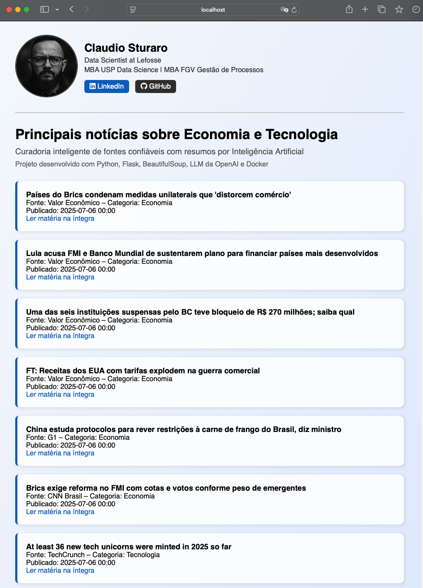

## PROJETO:

## Curadoria Inteligente de Notícias sobre Economia e Tecnologia

Este é um projeto pessoal de uso real no meu dia a dia.

Aplicação em **Python**, que realiza a **coleta automatizada de notícias** a partir de fontes confiáveis e utiliza **modelos de IA hospedados no Azure AI Foundry** para **filtrar e resumir as mais relevantes** nas áreas de **Economia** e **Tecnologia**. As notícias curadas são entregues automaticamente por **e-mail** e **WhatsApp** (via CallMeBot) em uma rotina diária, além de uma interface web em **Flask** que exibe as manchetes com resumos gerados por IA e o link para a notícia na íntegra.

---



---

### 🚀 Escopo do Projeto

- 🔎 Web scraping com `requests` e `BeautifulSoup`
- 🤖 Filtragem e resumo das notícias com modelos servidos via **Azure AI Foundry** (endpoint de projeto, autenticado com Azure Identity)
- 📧 Envio automático das notícias por e-mail
- 📱 Envio automático das notícias por WhatsApp via **CallMeBot**
- 🌐 Interface web com `Flask`
- 📸 Exibição de perfil com foto e link do LinkedIn
- 🐳 Deploy com Docker

---

### 🧠 Tecnologias utilizadas

- Python=3.13
- Flask
- Requests
- BeautifulSoup
- Python Dotenv
- Azure AI Foundry (`azure-ai-projects`, `azure-identity`) — modelo atual: `gpt-5.4-mini`
- CallMeBot (WhatsApp)
- Docker

---

### 🛠 Como executar localmente

#### 1. Clone este repositório em uma pasta local

```bash
git clone https://github.com/sturaro-ds/curadoria_de_noticias.git
```

#### 2. Configure o arquivo `.env`

Na pasta onde clonou o repositório, crie um arquivo `.env` com o seguinte conteúdo:

```
# Azure AI Foundry
FOUNDRY_PROJ_ENDPOINT=https://<seu-recurso>.services.ai.azure.com/api/projects/<seu-projeto>

# E-mail (rotina automatizada)
LOG_PATH_FILE=caminho/para/logs/log_emails.txt
EMAIL_FROM=seu-email@gmail.com
EMAIL_PASSWORD=sua-senha-de-app
EMAIL_TO=destinatario@exemplo.com
EMAIL_TO_BCC=lista,de,assinantes@exemplo.com

# WhatsApp (CallMeBot)
CALLMEBOT_PHONE=+5511999999999
CALLMEBOT_APIKEY=sua-apikey-callmebot
```

A autenticação no Azure AI Foundry usa `DefaultAzureCredential` (pacote `azure-identity`) — não é necessária nenhuma chave de API no `.env` para o modelo, mas é preciso estar autenticado localmente (`az login`) na assinatura Azure onde o projeto Foundry foi criado, ou configurar uma identidade gerenciada/service principal no ambiente onde o projeto rodar.

#### 3. Instale as dependências e rode a rotina de coleta + envio

```bash
uv sync
uv run enviar_news_email.py
```

A rotina completa (scraping → curadoria com IA via Foundry → e-mail → WhatsApp) também pode ser agendada via cron/launchd usando o script `stunews.sh`.

---

### 🐳 Rodando com Docker

#### Build da imagem:

```bash
docker build -t app-noticias .
```

#### Executando o contêiner:

```bash
docker run -p 8000:8000 app-noticias
```

#### Acesse no navegador:

[http://localhost:8000](http://localhost:8000)

---

### 📄 Licença

Este projeto está licenciado sob a **MIT License**.
